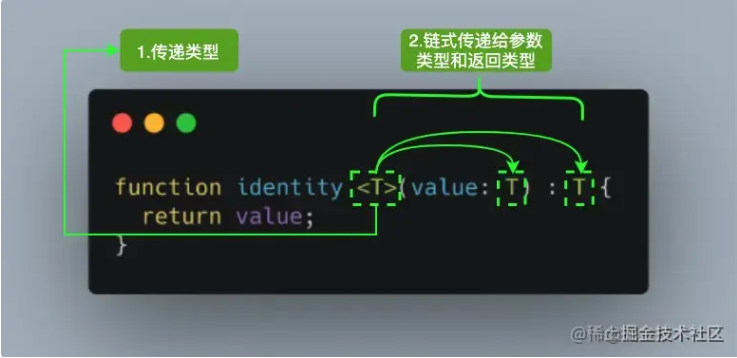

### 泛型介绍

假如让你实现一个函数 `identity`，函数的参数可以是任何值，返回值就是将参数原样返回，并且其只能接受一个参数，你会怎么做？

你会觉得这很简单，顺手就写出这样的代码：

```js
const identity = (arg) => arg;
```

由于其可以接受任意值，也就是说你的函数的入参和返回值都应该可以是任意类型。 现在让我们给代码增加类型声明：

```js
type idBoolean = (arg: boolean) => boolean;
type idNumber = (arg: number) => number;
type idString = (arg: string) => string;
...
```

一个笨的方法就像上面那样，也就是说 JS 提供多少种类型，就需要复制多少份代码，然后改下类型签名。这对程序员来说是致命的。这种复制粘贴增加了出错的概率，使得代码难以维护，牵一发而动全身。并且将来 JS 新增新的类型，你仍然需要修改代码，也就是说你的代码**对修改开放**，这样不好。还有一种方式是使用 any 这种“万能语法”。缺点是什么呢？我举个例子：

```js
identity("string").length; // ok
identity("string").toFixed(2); // ok
identity(null).toString(); // ok
...
```

如果你使用 any 的话，怎么写都是 ok 的， 这就丧失了类型检查的效果。实际上我知道我传给你的是 string，返回来的也一定是 string，而 string 上没有 toFixed 方法，因此需要报错才是我想要的。也就是说我真正想要的效果是：`当我用到id的时候，你根据我传给你的类型进行推导`。比如我传入的是 string，但是使用了 number 上的方法，你就应该报错。

为了解决上面的这些问题，我们**使用泛型对上面的代码进行重构**。和我们的定义不同，这里用了一个 类型 T，这个 **T 是一个抽象类型，只有在调用的时候才确定它的值**，这就不用我们复制粘贴无数份代码了。

```js
function identity<T>(arg: T): T {
  return arg;
}
```

其中 `T` 代表 **Type**，在定义泛型时通常用作第一个类型变量名称。但实际上 `T` 可以用任何有效名称代替。除了 `T` 之外，以下是常见泛型变量代表的意思：

- K（Key）：表示对象中的键类型；
- V（Value）：表示对象中的值类型；
- E（Element）：表示元素类型。

来张图片帮助你理解 

其实并不是只能定义一个类型变量，我们可以引入希望定义的任何数量的类型变量。比如我们引入一个新的类型变量 `U`，用于扩展我们定义的 `identity` 函数：

```js
function identity <T, U>(value: T, message: U) : T {
  console.log(message);
  return value;
}
console.log(identity<Number, string>(68, "Semlinker"));
```


除了为类型变量显式设定值之外，一种更常见的做法是使编译器自动选择这些类型，从而使代码更简洁。我们可以完全省略尖括号，比如：

```js
function identity <T, U>(value: T, message: U) : T {
  console.log(message);
  return value;
}
console.log(identity(68, "Semlinker"));
```

对于上述代码，编译器足够聪明，能够知道我们的参数类型，并将它们赋值给 T 和 U，而不需要开发人员显式指定它们。

### 泛型约束

假如我想打印出参数的 size 属性呢？如果完全不进行约束 TS 是会报错的：

```js
function trace<T>(arg: T): T {
  console.log(arg.size); // Error: Property 'size doesn't exist on type 'T'
  return arg;
}
```

报错的原因在于 T 理论上是可以是任何类型的，不同于 any，你不管使用它的什么属性或者方法都会报错（除非这个属性和方法是所有集合共有的）。那么直观的想法是限定传给 trace 函数的**参数类型**应该有 size 类型，这样就不会报错了。如何去表达这个**类型约束**的点呢？实现这个需求的关键在于使用类型约束。 使用 extends 关键字可以做到这一点。简单来说就是你定义一个类型，然后让 T 实现这个接口即可。

```js
interface Sizeable {
  size: number;
}
function trace<T extends Sizeable>(arg: T): T {
  console.log(arg.size);
  return arg;
}
```

有的人可能说我直接将 Trace 的参数限定为 Sizeable 类型可以么？如果你这么做，会有类型丢失的风险，详情可以参考这篇文章[A use case for TypeScript Generics](https://link.juejin.cn?target=https%3A%2F%2Fjuliangaramendy.dev%2Fwhen-ts-generics%2F)。

### 泛型工具类型

为了方便开发者 TypeScript 内置了一些常用的工具类型，比如 Partial、Required、Readonly、Record 和 ReturnType 等。不过在具体介绍之前，我们得先介绍一些相关的基础知识，方便读者可以更好的学习其它的工具类型。

#### 1.typeof

typeof 的主要用途是在类型上下文中获取变量或者属性的类型，下面我们通过一个具体示例来理解一下。

```js
interface Person {
  name: string;
  age: number;
}
const sem: Person = { name: "semlinker", age: 30 };
type Sem = typeof sem; // type Sem = Person
```

在上面代码中，我们通过 `typeof` 操作符获取 sem 变量的类型并赋值给 Sem 类型变量，之后我们就可以使用 Sem 类型：

```js
const lolo: Sem = { name: "lolo", age: 5 }
```

你也可以对嵌套对象执行相同的操作：

```js
const Message = {
    name: "jimmy",
    age: 18,
    address: {
      province: '四川',
      city: '成都'   
    }
}
type message = typeof Message;
/*
 type message = {
    name: string;
    age: number;
    address: {
        province: string;
        city: string;
    };
}
*/
```

此外，`typeof` 操作符除了可以获取对象的结构类型之外，它也可以用来获取函数对象的类型，比如：

```js
function toArray(x: number): Array<number> {
  return [x];
}
type Func = typeof toArray; // -> (x: number) => number[]
```

#### 2.keyof

`keyof` 操作符是在 TypeScript 2.1 版本引入的，该操作符可以用于获取某种类型的所有键，其返回类型是联合类型。

```js
interface Person {
  name: string;
  age: number;
}

type K1 = keyof Person; // "name" | "age"
type K2 = keyof Person[]; // "length" | "toString" | "pop" | "push" | "concat" | "join" 
type K3 = keyof { [x: string]: Person };  // string | number
```

在 TypeScript 中支持两种索引签名，数字索引和字符串索引：

```js
interface StringArray {
  // 字符串索引 -> keyof StringArray => string | number
  [index: string]: string; 
}

interface StringArray1 {
  // 数字索引 -> keyof StringArray1 => number
  [index: number]: string;
}
```

为了同时支持两种索引类型，就得要求数字索引的返回值必须是字符串索引返回值的子类。**其中的原因就是当使用数值索引时，JavaScript 在执行索引操作时，会先把数值索引先转换为字符串索引**。所以 `keyof { [x: string]: Person }` 的结果会返回 `string | number`。

keyof也支持基本数据类型：

```
let K1: keyof boolean; // let K1: "valueOf"
let K2: keyof number; // let K2: "toString" | "toFixed" | "toExponential" | ...
let K3: keyof symbol; // let K1: "valueOf"
```

##### keyof 的作用

JavaScript 是一种高度动态的语言。有时在静态类型系统中捕获某些操作的语义可能会很棘手。以一个简单的`prop` 函数为例：

```js
function prop(obj, key) {
  return obj[key];
}
```

该函数接收 obj 和 key 两个参数，并返回对应属性的值。对象上的不同属性，可以具有完全不同的类型，我们甚至不知道 obj 对象长什么样。

那么在 TypeScript 中如何定义上面的 `prop` 函数呢？我们来尝试一下：

```js
function prop(obj: object, key: string) {
  return obj[key];
}
```

在上面代码中，为了避免调用 prop 函数时传入错误的参数类型，我们为 obj 和 key 参数设置了类型，分别为 `{}` 和 `string` 类型。然而，事情并没有那么简单。针对上述的代码，TypeScript 编译器会输出以下错误信息：

```js
Element implicitly has an 'any' type because expression of type 'string' can't be used to index type '{}'.
```

元素隐式地拥有 `any` 类型，因为 `string` 类型不能被用于索引 `{}` 类型。要解决这个问题，你可以使用以下非常暴力的方案：

```js
function prop(obj: object, key: string) {
  return (obj as any)[key];
}
```

很明显该方案并不是一个好的方案，我们来回顾一下 `prop` 函数的作用，该函数用于获取某个对象中指定属性的属性值。因此我们期望用户输入的属性是对象上已存在的属性，那么如何限制属性名的范围呢？这时我们可以利用本文的主角 `keyof` 操作符：

```js
function prop<T extends object, K extends keyof T>(obj: T, key: K) {
  return obj[key];
}
```

在以上代码中，我们使用了 TypeScript 的泛型和泛型约束。**首先定义了 T 类型并使用 `extends` 关键字约束该类型必须是 object 类型的子类型，然后使用 `keyof` 操作符获取 T 类型的所有键，其返回类型是联合类型，最后利用 `extends` 关键字约束 K 类型必须为 `keyof T` 联合类型的子类型。**  是骡子是马拉出来遛遛就知道了，我们来实际测试一下：

```js
type Todo = {
  id: number;
  text: string;
  done: boolean;
}

const todo: Todo = {
  id: 1,
  text: "Learn TypeScript keyof",
  done: false
}

function prop<T extends object, K extends keyof T>(obj: T, key: K) {
  return obj[key];
}

const id = prop(todo, "id"); // const id: number
const text = prop(todo, "text"); // const text: string
const done = prop(todo, "done"); // const done: boolean
```

很明显使用泛型，重新定义后的 `prop<T extends object, K extends keyof T>(obj: T, key: K)` 函数，已经可以正确地推导出指定键对应的类型。那么当访问 todo 对象上不存在的属性时，会出现什么情况？比如：

```js
const date = prop(todo, "date");
```

对于上述代码，TypeScript 编译器会提示以下错误：

```js
Argument of type '"date"' is not assignable to parameter of type '"id" | "text" | "done"'.
```

这就阻止我们尝试读取不存在的属性。

#### 3.in

`in` 用来遍历枚举类型：

```js
type Keys = "a" | "b" | "c"

type Obj =  {
  [p in Keys]: any
} // -> { a: any, b: any, c: any }
```

#### 4.infer

在条件类型语句中，可以用 `infer` 声明一个类型变量并且对它进行使用。

```js
type ReturnType<T> = T extends (
  ...args: any[]
) => infer R ? R : any;
复制代码
```

以上代码中 `infer R` 就是声明一个变量来承载传入函数签名的返回值类型，简单说就是用它取到函数返回值的类型方便之后使用。

#### 5.extends

有时候我们定义的泛型不想过于灵活或者说想继承某些类等，可以通过 extends 关键字添加泛型约束。

```js
interface Lengthwise {
  length: number;
}

function loggingIdentity<T extends Lengthwise>(arg: T): T {
  console.log(arg.length);
  return arg;
}
```

现在这个泛型函数被定义了约束，因此它不再是适用于任意类型：

```js
loggingIdentity(3);  // Error, number doesn't have a .length property
```

这时我们需要传入符合约束类型的值，必须包含length属性：

```js
loggingIdentity({length: 10, value: 3});
```

#### 索引类型

在实际开发中，我们经常能遇到这样的场景，在对象中获取一些属性的值，然后建立对应的集合。

```js
let person = {
    name: 'musion',
    age: 35
}

function getValues(person: any, keys: string[]) {
    return keys.map(key => person[key])
}

console.log(getValues(person, ['name', 'age'])) // ['musion', 35]
console.log(getValues(person, ['gender'])) // [undefined]
```

在上述例子中，可以看到getValues(persion, ['gender'])打印出来的是[undefined]，但是ts编译器并没有给出报错信息，那么如何使用ts对这种模式进行类型约束呢？这里就要用到了索引类型,改造一下getValues函数，通过 **索引类型查询**和 **索引访问** 操作符：

```js
function getValues<T, K extends keyof T>(person: T, keys: K[]): T[K][] {
  return keys.map(key => person[key]);
}

interface Person {
    name: string;
    age: number;
}

const person: Person = {
    name: 'musion',
    age: 35
}

getValues(person, ['name']) // ['musion']
getValues(person, ['gender']) // 报错：
// Argument of Type '"gender"[]' is not assignable to parameter of type '("name" | "age")[]'.
// Type "gender" is not assignable to type "name" | "age".
```

编译器会检查传入的值是否是Person的一部分。通过下面的概念来理解上面的代码：

```js
T[K]表示对象T的属性K所表示的类型，在上述例子中，T[K][] 表示变量T取属性K的值的数组

// 通过[]索引类型访问操作符, 我们就能得到某个索引的类型
class Person {
    name:string;
    age:number;
 }
 type MyType = Person['name'];  //Person中name的类型为string type MyType = string
```

介绍完概念之后，应该就可以理解上面的代码了。首先看泛型，这里有T和K两种类型，根据类型推断，第一个参数person就是person，类型会被推断为Person。而第二个数组参数的类型推断（K extends keyof T），keyof关键字可以获取T，也就是Person的所有属性名，即['name', 'age']。而extends关键字让泛型K继承了Person的所有属性名，即['name', 'age']。这三个特性组合保证了代码的动态性和准确性，也让代码提示变得更加丰富了

```js
getValues(person, ['gender']) // 报错：
// Argument of Type '"gender"[]' is not assignable to parameter of type '("name" | "age")[]'.
// Type "gender" is not assignable to type "name" | "age".
复制代码
```

#### 映射类型

> 根据旧的类型创建出新的类型, 我们称之为映射类型

比如我们定义一个接口

```js
interface TestInterface{
    name:string,
    age:number
}
```

我们把上面定义的接口里面的属性全部变成可选

```js
// 我们可以通过+/-来指定添加还是删除

type OptionalTestInterface<T> = {
  [p in keyof T]+?:T[p]
}

type newTestInterface = OptionalTestInterface<TestInterface>
// type newTestInterface = {
//    name?:string,
//    age?:number
// }
```

比如我们再加上只读

```js
type OptionalTestInterface<T> = {
 +readonly [p in keyof T]+?:T[p]
}

type newTestInterface = OptionalTestInterface<TestInterface>
// type newTestInterface = {
//   readonly name?:string,
//   readonly age?:number
// }
```

由于生成只读属性和可选属性比较常用, 所以TS内部已经给我们提供了现成的实现 Readonly / Partial,会面内置的工具类型会介绍.

**内置的工具类型**

#### Partial

> `Partial<T>` 将类型的属性变成可选

##### 定义

```js
type Partial<T> = {
  [P in keyof T]?: T[P];
};
```

在以上代码中，首先通过 `keyof T` 拿到 `T` 的所有属性名，然后使用 `in` 进行遍历，将值赋给 `P`，最后通过 `T[P]` 取得相应的属性值的类。中间的 `?` 号，用于将所有属性变为可选。

##### 举例说明

```js
interface UserInfo {
    id: string;
    name: string;
}
// error：Property 'id' is missing in type '{ name: string; }' but required in type 'UserInfo'
const xiaoming: UserInfo = {
    name: 'xiaoming'
}
```

使用  `Partial<T>`

```js
type NewUserInfo = Partial<UserInfo>;
const xiaoming: NewUserInfo = {
    name: 'xiaoming'
}
```

这个  NewUserInfo 就相当于

```js
interface NewUserInfo {
    id?: string;
    name?: string;
}
```

但是 `Partial<T>` 有个局限性，就是只支持处理第一层的属性，如果我的接口定义是这样的

```js
interface UserInfo {
    id: string;
    name: string;
    fruits: {
        appleNumber: number;
        orangeNumber: number;
    }
}

type NewUserInfo = Partial<UserInfo>;

// Property 'appleNumber' is missing in type '{ orangeNumber: number; }' but required in type '{ appleNumber: number; orangeNumber: number; }'.
const xiaoming: NewUserInfo = {
    name: 'xiaoming',
    fruits: {
        orangeNumber: 1,
    }
}
```

可以看到，第二层以后就不会处理了，如果要处理多层，就可以自己实现

#### DeepPartial

```js
type DeepPartial<T> = {
     // 如果是 object，则递归类型
    [U in keyof T]?: T[U] extends object
      ? DeepPartial<T[U]>
      : T[U]
};

type PartialedWindow = DeepPartial<T>; // 现在T上所有属性都变成了可选啦
```

#### Required

> Required将类型的属性变成必选

##### 定义

```js
type Required<T> = { 
    [P in keyof T]-?: T[P] 
};
```

其中 `-?` 是代表移除 `?` 这个 modifier 的标识。再拓展一下，除了可以应用于 `?` 这个 modifiers ，还有应用在 `readonly` ，比如 `Readonly<T>` 这个类型

```js
type Readonly<T> = {
    readonly [p in keyof T]: T[p];
}
```

#### Readonly

> `Readonly<T>` 的作用是将某个类型所有属性变为只读属性，也就意味着这些属性不能被重新赋值。

##### 定义

```js
type Readonly<T> = {
 readonly [P in keyof T]: T[P];
};
```

##### 举例说明

```js
interface Todo {
 title: string;
}

const todo: Readonly<Todo> = {
 title: "Delete inactive users"
};

todo.title = "Hello"; // Error: cannot reassign a readonly property
```

#### Pick

> Pick 从某个类型中挑出一些属性出来

##### 定义

```js
type Pick<T, K extends keyof T> = {
    [P in K]: T[P];
};
```

##### 举例说明

```js
interface Todo {
  title: string;
  description: string;
  completed: boolean;
}

type TodoPreview = Pick<Todo, "title" | "completed">;

const todo: TodoPreview = {
  title: "Clean room",
  completed: false,
};
```

可以看到 NewUserInfo 中就只有个 name 的属性了。

#### Record

> `Record<K extends keyof any, T>` 的作用是将 `K` 中所有的属性的值转化为 `T` 类型。

##### 定义

```js
type Record<K extends keyof any, T> = {
    [P in K]: T;
};
```

##### 举例说明

```js
interface PageInfo {
  title: string;
}

type Page = "home" | "about" | "contact";

const x: Record<Page, PageInfo> = {
  about: { title: "about" },
  contact: { title: "contact" },
  home: { title: "home" },
};
```

#### ReturnType

> 用来得到一个函数的返回值类型

##### 定义

```js
type ReturnType<T extends (...args: any[]) => any> = T extends (
  ...args: any[]
) => infer R
  ? R
  : any;
```

`infer`在这里用于提取函数类型的返回值类型。`ReturnType<T>` 只是将 infer R 从参数位置移动到返回值位置，因此此时 R 即是表示待推断的返回值类型。

##### 举例说明

```js
type Func = (value: number) => string;
const foo: ReturnType<Func> = "1";
```

`ReturnType`获取到 `Func` 的返回值类型为 `string`，所以，`foo` 也就只能被赋值为字符串了。

#### Exclude

> `Exclude<T, U>` 的作用是将某个类型中属于另一个的类型移除掉。

##### 定义

```js
type Exclude<T, U> = T extends U ? never : T;
```

如果 `T` 能赋值给 `U` 类型的话，那么就会返回 `never` 类型，否则返回 `T` 类型。最终实现的效果就是将 `T` 中某些属于 `U` 的类型移除掉。

##### 举例说明

```js
type T0 = Exclude<"a" | "b" | "c", "a">; // "b" | "c"
type T1 = Exclude<"a" | "b" | "c", "a" | "b">; // "c"
type T2 = Exclude<string | number | (() => void), Function>; // string | number
```

#### Extract

> `Extract<T, U>` 的作用是从 `T` 中提取出 `U`。

##### 定义

```js
type Extract<T, U> = T extends U ? T : never;
```

##### 举例说明

```js
type T0 = Extract<"a" | "b" | "c", "a" | "f">; // "a"
type T1 = Extract<string | number | (() => void), Function>; // () =>void
```

#### Omit

> `Omit<T, K extends keyof any>` 的作用是使用 `T` 类型中除了 `K` 类型的所有属性，来构造一个新的类型。

##### 定义

```js
type Omit<T, K extends keyof any> = Pick<T, Exclude<keyof T, K>>;
```

##### 举例说明

```js
interface Todo {
  title: string;
  description: string;
  completed: boolean;
}

type TodoPreview = Omit<Todo, "description">;

const todo: TodoPreview = {
  title: "Clean room",
  completed: false,
};
```

#### NonNullable

> `NonNullable<T>` 的作用是用来过滤类型中的 `null` 及 `undefined` 类型。

##### 定义

```js
type NonNullable<T> = T extendsnull | undefined ? never : T;
```

##### 举例说明

```js
type T0 = NonNullable<string | number | undefined>; // string | number
type T1 = NonNullable<string[] | null | undefined>; // string[]
```

#### Parameters

> `Parameters<T>` 的作用是用于获得函数的参数类型组成的元组类型。

##### 定义

```js
type Parameters<T extends (...args: any) => any> = T extends (...args: infer P) => any
? P : never;
```

##### 举例说明

```js
type A = Parameters<() =>void>; // []
type B = Parameters<typeofArray.isArray>; // [any]
type C = Parameters<typeofparseInt>; // [string, (number | undefined)?]
type D = Parameters<typeofMath.max>; // number[]
```

